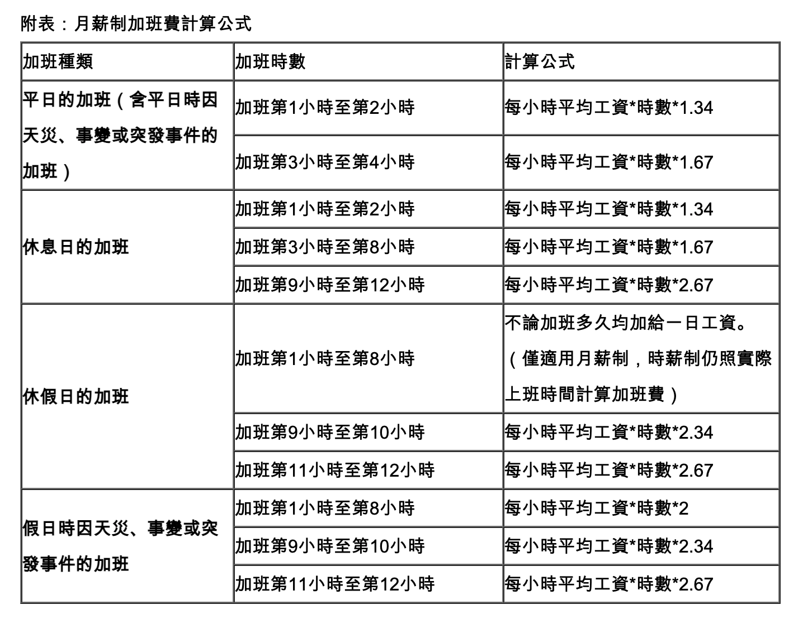

# 加班費計算 TDD 練習

## 計算方式

## 目標

1. 使用 [RSpec](https://rspec.info/) 撰寫適當的測試個案，並通過全部測試。
2. 關於時間的問題，可適時使用 [timecop](https://github.com/travisjeffery/timecop) 套件

## 設定

1. 下載本專案後，執行 `bundle install` 指令安裝所需套件。
2. 執行 `rspec` 並通過全部測試。
